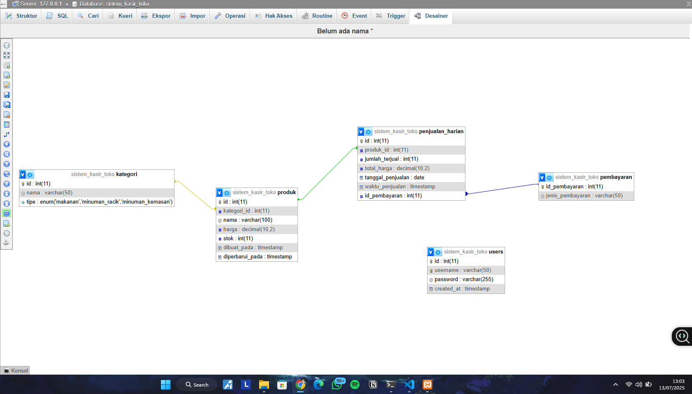
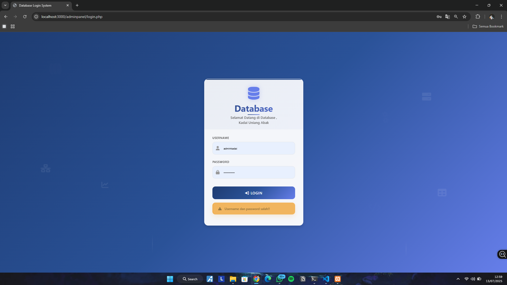
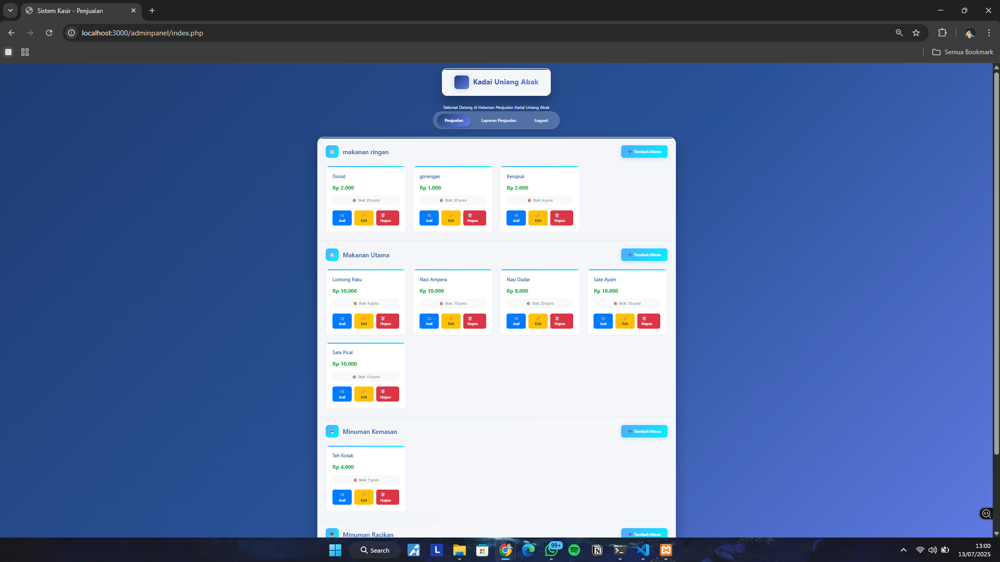
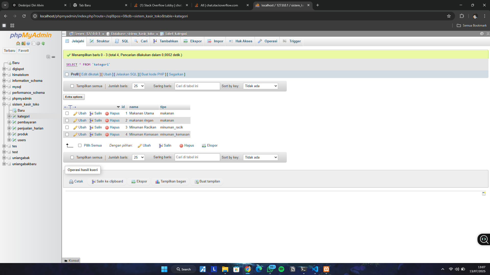
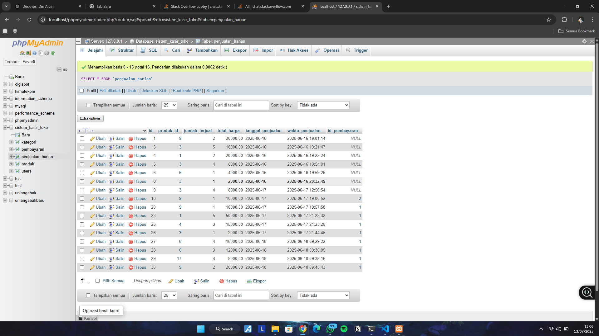
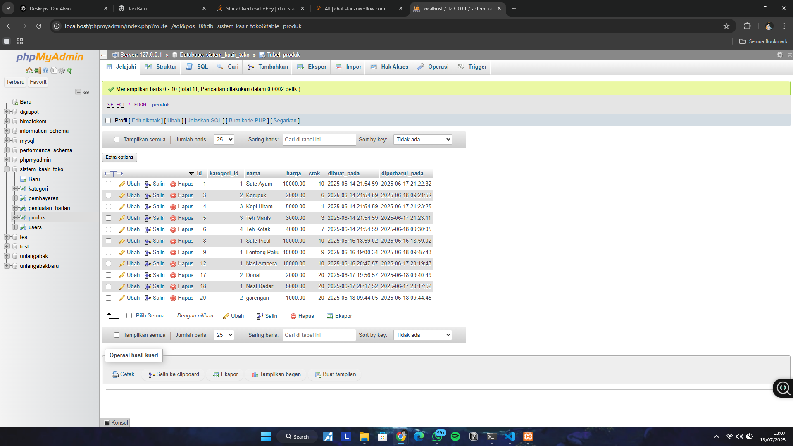

# 💻 Web-based POS System – Database Systems Project (Group 5)

This is a simple web-based point-of-sale (POS) application built using **PHP Native** and **MySQL**, developed as part of a course project for *Database Systems*.  
It is designed to assist small food businesses (UMKM) in managing sales transactions efficiently and systematically.

## Key Features

- Admin login authentication
- Menu category management (light meals, main courses, bottled drinks, custom-made drinks)
- Add, edit, and delete menu items
- Automatic stock reduction during transactions
- Daily sales reporting
- Filters by date, category, and payment method
- Export reports to Microsoft Word
- 🖥Modern and responsive UI design

## Technologies Used

- PHP Native
- MySQL
- HTML, CSS, minimal JavaScript
- XAMPP (Apache & MySQL)

## Website Screenshots

### 🔹 ER Diagram

### 🔹 Login Page

### 🔹 Sales Page

### 🔹 Sales Report Page

### 🔹 Table Structure – Categories

### 🔹 Table Structure – Sales

### 🔹 Table Structure – Products

---

## 🌐 Live Demo

You can try the system live here:  
🔗 [kadaiuniangabak.great-site.net](http://kadaiuniangabak.great-site.net)

---

## 👨‍💻 My Contributions

This project was completed as a group assignment (Group 5).  
I contributed as:
- Lead developer (back-end & front-end integration)
- System logic & database designer
- Writer of technical documentation and report

---

## 📂 Project Goals

- Practice CRUD implementation using PHP & MySQL
- Build a real-world POS system for small businesses
- Learn full-stack integration from UI to database to reporting

---

## 📬 Contact

**Alvin Wahyudi**  
[📧 Email](mailto:alvinwahyudi2005@gmail.com)  
[🔗 LinkedIn](www.linkedin.com/in/alvinwahyudi)

---

> 🚀 Thank you for checking out this project!  
> I hope it can be a useful reference for others learning full-stack web development.
