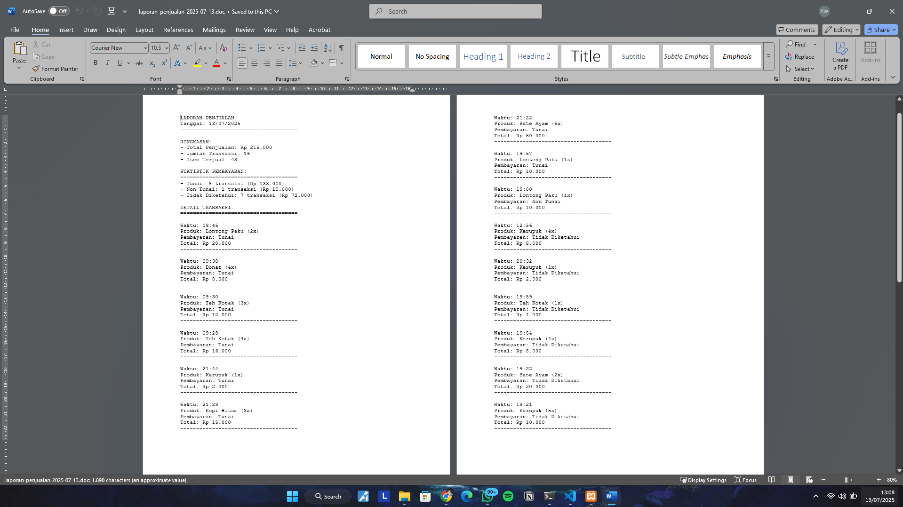

# 💻 Sistem Kasir Web – Project Sistem Basis Data (Kelompok 5)

Ini adalah proyek aplikasi web kasir sederhana berbasis PHP & MySQL, dibuat dalam rangka tugas mata kuliah Sistem Basis Data. Aplikasi ini dirancang untuk membantu pengelolaan penjualan makanan di UMKM.

---

## ✨ Fitur Utama

-Login Admin
- Kategori menu: makanan ringan dan makanan utama serta minuman kemasan dan minuman buatan
- Tambah, edit, dan hapus menu
- Update stok otomatis saat transaksi penjualan
- Laporan penjualan harian dengan filter tanggal, kategori, dan metode
- Export laporan ke Microsoft Word
- Desain UI modern 

---

## 🛠️ Teknologi yang Digunakan

- PHP Native
- MySQL
- Font Awesome
- XAMPP (Apache + MySQL)
- HTML, CSS, sedikit JavaScript

---

## 📸 Screenshot

### 🔹 Halaman Penjualan

### 🔹 Laporan Penjualan

*(Kamu bisa buat folder `screenshots` di repo, lalu upload screenshot-nya ke sana)*

---

## 🚀 Cara Menjalankan

1. Clone repo ini:
